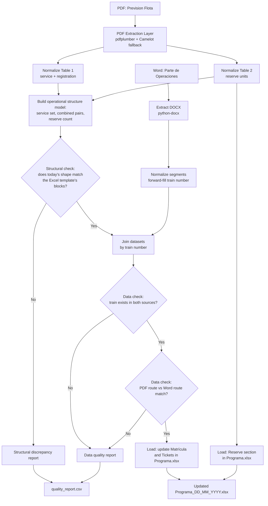

# ETL Pipeline Diagram

## Design notes

- The pipeline is designed as independent, idempotent steps (Extract →
  Normalize → Derive structure → Validate → Merge → Load), so that a
  later phase can orchestrate it with Airflow/Prefect without
  redesigning the logic.
- **Structural reconciliation happens first**, before any row-level
  data validation. The PDF is the source of truth for the day's
  *shape* — how many service blocks exist, which are combined
  (`301-302`), and how many reserve units there are — because this can
  legitimately change day to day. Skipping this check and jumping
  straight to data validation could silently misalign registrations
  and ticket counts against the wrong block if the day's structure
  shifted.
- Validation is not an optional final step: both the structural check
  and the data check run *before* writing to Excel, so inconsistent
  data never reaches the official document.
- Discrepancies don't halt the whole pipeline (fail-soft): they are
  documented in `quality_report.csv`, and every service without
  detected issues is still loaded.
