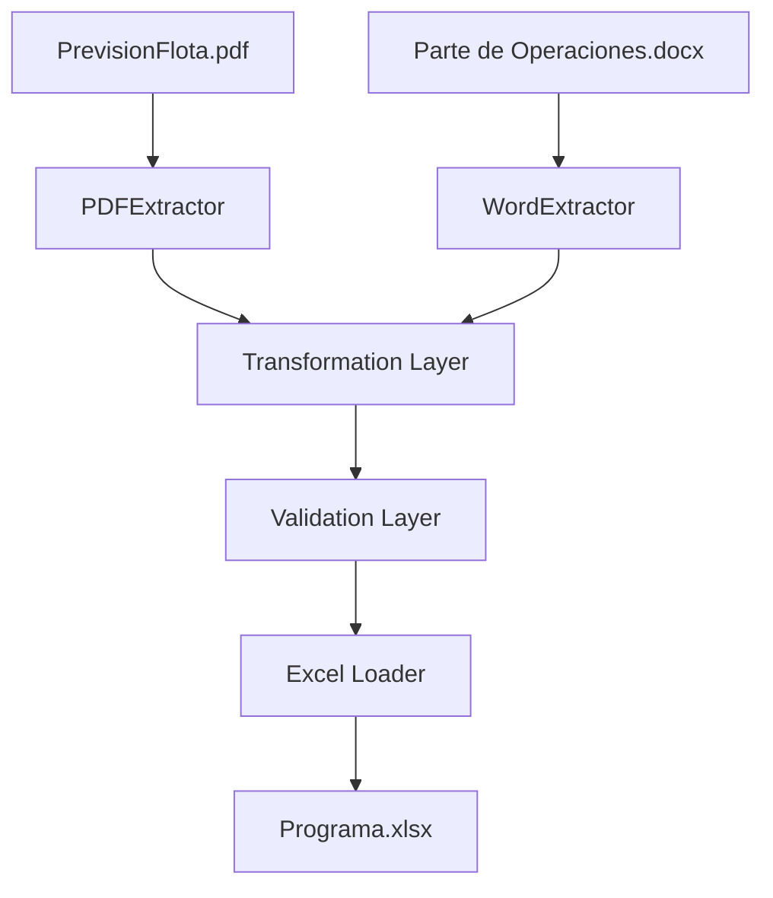

# System Architecture

## Overview

This project implements an ETL pipeline that extracts operational information from PDF and DOCX documents, transforms the data into structured datasets, validates consistency between sources, and updates the daily operational Excel workbook.

The system is divided into the following layers:

- **Extraction Layer:** Reads information from PDF and DOCX sources.
- **Transformation Layer:** Cleans and standardizes extracted data.
- **Validation Layer:** Checks data consistency and business rules.
- **Loading Layer:** Updates the operational Excel workbook.

## Architecture Diagram

## Components

### Extraction Layer

Responsible for extracting raw information from operational documents.

Components:

- PDFExtractor: processes `PrevisionFlota.pdf`.
- WordExtractor: processes `Parte de Operaciones.docx`.

### Transformation Layer

Responsible for cleaning, normalizing, and preparing datasets for validation.

### Validation Layer

Responsible for verifying:

- Train number consistency between sources.
- Route consistency.
- Structural compatibility with the Excel template.

### Loading Layer

Responsible for updating the required fields in `Programa.xlsx`.

## Output

The final output is an updated operational workbook containing validated information from the source documents.