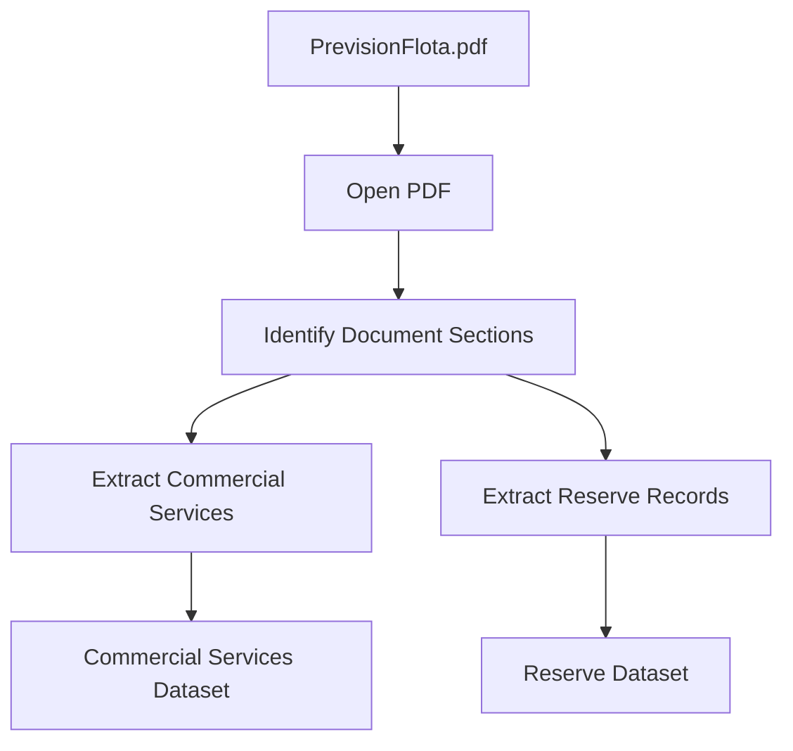

# PDF Extractor Design

## Overview

The PDF Extractor is responsible for extracting operational information from the `PrevisionFlota.pdf` document.

The document contains semi-structured information arranged in tabular sections. The extractor converts this information into structured datasets that can be consumed by the transformation layer.

The extractor focuses only on data extraction and does not perform validation, business rule evaluation, or Excel updates.

---

## Input

| Source | Format | Description |
|---|---|---|
| PrevisionFlota.pdf | PDF | Fleet forecast document containing commercial circulation and reserve information. |

---

## Document Structure

The PDF contains two main information sections:

### 1. Commercial Services Section

Contains information about planned commercial circulations.

Required fields:

| Field | Description |
|---|---|
| Service | Train service number. |
| Registration | Rolling stock identification number. |

---

### 2. Reserve Section

Contains information about rolling stock availability.

Required fields:

| Field | Description |
|---|---|
| Workshop/Station | Location of the rolling stock. |
| Registration | Rolling stock identification number. |
| Status | Reserve status information (e.g., RESERVE). |

---

## Extraction Workflow

---

## Output

The extractor produces two structured datasets:

### Commercial Services Dataset

Contains:

- Service number.
- Rolling stock registration.

### Reserve Dataset

Contains:

- Workshop/Station.
- Rolling stock registration.
- Reserve status.

---

## Out of Scope

The PDF Extractor does not:

- Compare PDF data with the Operations Report.
- Validate train consistency.
- Update `Programa.xlsx`.
- Generate quality reports.