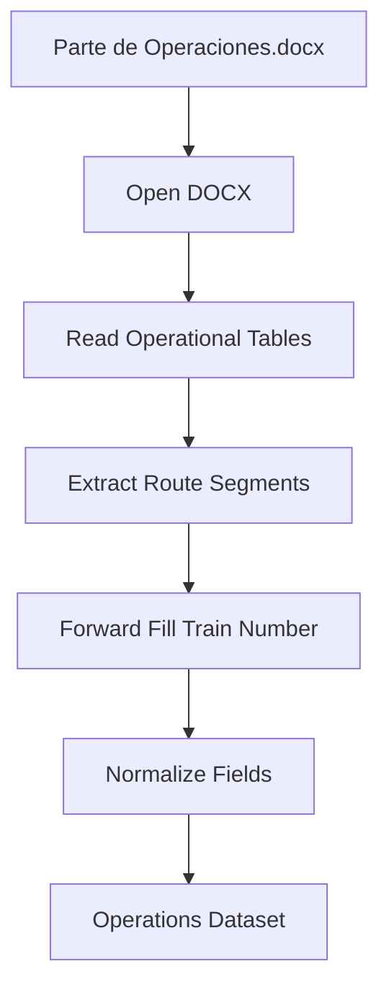

# Word Extractor Design

## Overview

The Word Extractor is responsible for extracting operational information from the `Parte de Operaciones.docx` document.

The document contains operational circulation information stored in tables. The extractor converts the document content into a structured dataset that can be consumed by the transformation layer.

The extractor focuses only on data extraction and does not perform data validation, source comparison, or Excel updates.

---

## Input

| Source | Format | Description |
|---|---|---|
| Parte de Operaciones.docx | DOCX | Operational report containing route information, train numbers, and ticket sales. |

---

## Document Structure

The document contains tabular operational information where each row represents an individual route segment.

Train numbers are not repeated in every row. The train identifier is provided only in the first row of each operational block, while subsequent route segments contain empty train number cells.

Required fields:

| Field | Description |
|---|---|
| Route Segment | Individual origin-destination segment of the train route. |
| Train Number | Three-digit train identifier associated with the route segment. |
| Tickets Sold | Number of tickets sold for the service. |

---

## Extraction Workflow

> **Note on scope**: the diagram below was drafted with a "Forward Fill
> Train Number" step inside the extractor. That was reconsidered — see
> `02_data_dictionary.md` and `07_transformation_design.md`. Forward-fill
> is **not** performed by the WordExtractor; it happens in the
> Transformation Layer instead. The extractor reads each row exactly as
> it appears in the document, including empty train-number cells. This
> keeps the extractor doing exactly one thing — reading the source
> as-is — and keeps all data-reconstruction logic in the layer already
> responsible for standardization. The diagram is kept below for
> historical reference; step **E** does not apply to this component.

---

## Data Normalization Considerations

The extractor must handle the following document characteristics:

- Route information is distributed across multiple rows.
- Each row represents an individual origin-destination segment.
- **Train Number cells are vertically merged in the source .docx** for
  all segments belonging to the same train. This was verified directly
  against the real document: `python-docx` returns the *same*
  underlying XML cell object (`cell._tc`) for every row spanned by the
  merge, and `.text` already reflects the train number on every row —
  there are no empty cells to fill in.

This means **no forward-fill is required**, by the extractor or by any
other layer, for this data. The earlier assumption (blank train-number
cells needing forward-fill, as originally described in
`02_data_dictionary.md` before the real .docx was inspected) does not
hold for the actual source file. That assumption is superseded by this
note.

The extractor should still **detect the block boundaries** (where one
train's segments end and the next train's begin) by tracking when the
train number value changes between consecutive rows — this is useful
downstream (e.g. to know how many segments belong to service `101`)
even though no value reconstruction is needed.

Example (actual extractor output — no gaps, verified against source):

| Route Segment | Train Number |
|---|---|
| Palenque – S.F. Campeche. | 101 |
| S.F. Campeche – Mérida Teya. | 101 |
| Mérida Teya – Cancún Aeropuerto. | 101 |
| Cancún Aeropuerto –Mérida Teya. | 102 |

---

## Output

The extractor produces an Operations Dataset containing:

- Route segment.
- Train number (as extracted — may be empty for non-first rows of a block).
- Tickets sold.

---

## Out of Scope

The Word Extractor does not:

- Compare train numbers with PDF information.
- Validate route consistency.
- Update `Programa.xlsx`.
- Apply business rules.
- Forward-fill train numbers — **not needed**: verified that Train
  Number cells are vertically merged in the source document, so
  `python-docx` already returns the correct value for every segment
  row with no reconstruction required.
