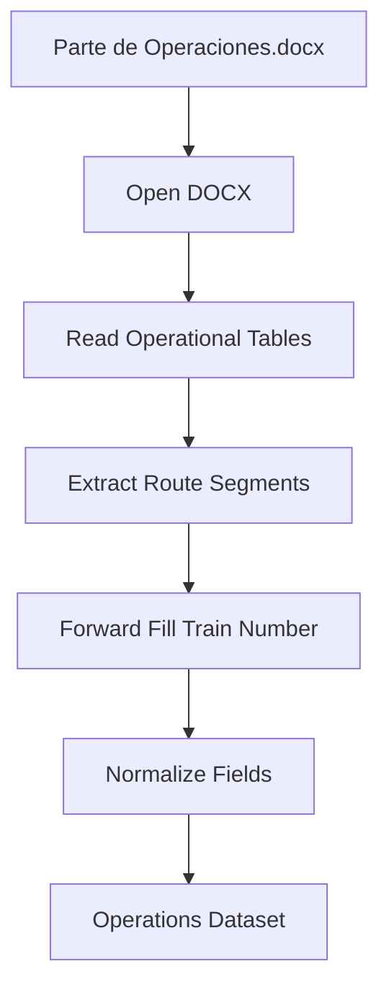

# Word Extractor Design

## Overview

The Word Extractor is responsible for extracting operational information from the `Parte de Operaciones.docx` document.

The document contains operational circulation information stored in tables. The extractor converts the document content into a structured dataset that can be consumed by the transformation layer.

The extractor focuses only on data extraction and does not perform data validation, source comparison, or Excel updates.

---

## Input

| Source | Format | Description |
|---|---|---|
| Parte de Operaciones.docx | DOCX | Operational report containing route information, train numbers, and ticket sales. |

---

## Document Structure

The document contains tabular operational information where each row represents an individual route segment.

Train numbers are not repeated in every row. The train identifier is provided only in the first row of each operational block, while subsequent route segments contain empty train number cells.

Required fields:

| Field | Description |
|---|---|
| Route Segment | Individual origin-destination segment of the train route. |
| Train Number | Three-digit train identifier associated with the route segment. |
| Tickets Sold | Number of tickets sold for the service. |

---

## Extraction Workflow

---

## Data Normalization Considerations

## Data Normalization Considerations

The extractor must handle the following document characteristics:

- Route information is distributed across multiple rows.
- Each row represents an individual origin-destination segment.
- Train numbers are only provided in the first row of each operational block.
- Empty train number values must be propagated using a forward-fill strategy.

Example:

| Route Segment | Train Number |
|---|---|
| Palenque - S.F. Campeche | 101 |
| S.F. Campeche - Mérida Teya | 101 |
| Mérida Teya - Cancún Aeropuerto | 101 |

The forward-fill operation ensures that all route segments are correctly associated with their corresponding train.

---

## Output

The extractor produces an Operations Dataset containing:

- Route.
- Train number.
- Tickets sold.

---

## Out of Scope

The Word Extractor does not:

- Compare train numbers with PDF information.
- Validate route consistency.
- Update `Programa.xlsx`.
- Apply business rules.