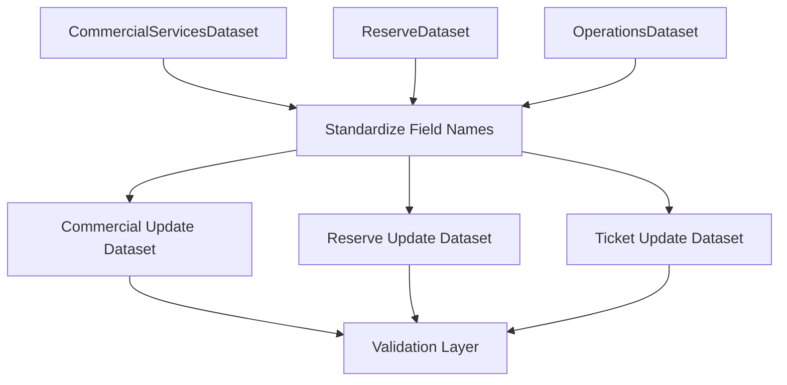

# Transformation Layer Design

## Overview

The Transformation Layer is responsible for preparing the extracted datasets for validation and loading into `Programa.xlsx`.

This layer standardizes the extracted information, creates update datasets, and ensures that each record contains the required information before entering the validation process.

The Transformation Layer does not extract data from source documents and does not update the Excel workbook directly.

---

## Input Datasets

The transformation process receives three datasets.

### CommercialServicesDataset

Source: `PrevisionFlota.pdf`

| Field | Description |
|---|---|
| Service | Commercial train service identifier. |
| Registration | Rolling stock registration assigned to the service. |

---

### ReserveDataset

Source: `PrevisionFlota.pdf`

| Field | Description |
|---|---|
| WorkshopStation | Workshop or station where the reserve unit is located. |
| Registration | Rolling stock registration. |
| Status | Reserve status (`RESERVA` or `RESERVA EN ESTACIÓN`). |

---

### OperationsDataset

Source: `Parte de Operaciones.docx`

| Field | Description |
|---|---|
| RouteSegment | Origin-destination operational segment. |
| Service | Train circulation (service) number. |
| TicketsSold | Number of tickets sold for the service. |

---

## Transformation Workflow

---

## Transformation Rules

### Standardize Data

The transformation layer standardizes:

- Field names.
- Text formatting.
- Data types.
- Empty values generated during extraction.

---

### Commercial Services

The Commercial Services dataset prepares the information required to update the **Registration** column in `Programa.xlsx`.

Each record contains:

- Service
- Registration

---

### Reserve Records

Reserve records are transformed into a standardized dataset containing:

- WorkshopStation
- Registration
- Status

These records will populate the Reserve section of `Programa.xlsx`.

---

### Ticket Information

The Operations dataset prepares the information required to update ticket sales.

Only the **TicketsSold** field will be loaded into `Programa.xlsx`.

The fields **RouteSegment** and **Service** are preserved because they are required during the validation process before updating the workbook.

---

## Output Datasets

The Transformation Layer produces three update datasets.

### CommercialUpdateDataset

Used to update:

- Registration

Matching field:

- Service

---

### TicketUpdateDataset

Used to update:

- TicketsSold

Validation fields:

- Service
- RouteSegment

---

### ReserveUpdateDataset

Used to update the Reserve section of `Programa.xlsx`.

Contains:

- WorkshopStation
- Registration
- Status

---

## Out of Scope

The Transformation Layer does not:

- Validate business rules.
- Compare datasets.
- Detect inconsistencies.
- Update `Programa.xlsx`.
- Generate quality reports.