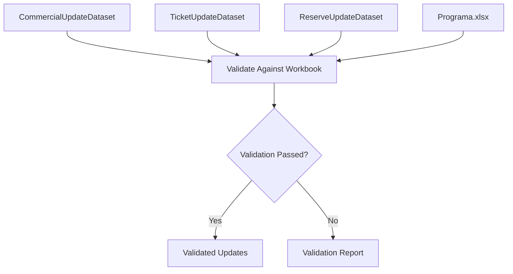

# Validation Layer Design

## Overview

The Validation Layer is responsible for ensuring that the information extracted from the source documents matches the operational structure already defined in `Programa.xlsx`.

Rather than comparing source documents against each other, this layer validates that extracted records correspond to the correct rows in the workbook before any updates are applied.

Only validated records are passed to the loading process.

---

## Validation Workflow

---

# Business Validation Rules

## BR-001 Commercial Service Validation

**Source**

PrevisionFlota.pdf

**Validation**

The extracted **Service** must exist in the corresponding commercial circulation row of `Programa.xlsx`.

**Purpose**

Ensure that the rolling stock registration is assigned to the correct circulation.

**Update**

Registration

**Failure Action**

- Skip the update.
- Record the issue in the validation report.

---

## BR-002 Ticket Sales Validation

**Source**

Parte de Operaciones.docx

**Validation**

Before updating ticket sales, both fields must match the existing row in `Programa.xlsx`:

- Service
- RouteSegment

**Purpose**

Ensure that ticket sales are assigned to the correct operational service.

**Update**

TicketsSold

**Failure Action**

- Skip the update.
- Record the discrepancy.

---

## BR-003 Registration Validation

**Source**

PrevisionFlota.pdf

**Validation**

Registration must contain a valid value.

**Purpose**

Prevent empty rolling stock assignments.

**Failure Action**

- Skip the update.
- Record the issue.

---

## BR-004 Reserve Record Validation

**Source**

PrevisionFlota.pdf

Each reserve record must contain:

- WorkshopStation
- Registration
- Status

The Status field must contain one of the following values:

- RESERVA
- RESERVA EN ESTACIÓN

**Purpose**

Ensure that reserve information is complete before updating the Reserve section.

**Failure Action**

- Skip the reserve record.
- Record the issue.

---

# Validation Output

The Validation Layer generates two outputs.

## Validated Updates

Contains only records that passed every validation rule.

These records are ready to update:

- Registration
- TicketsSold
- Reserve section

in `Programa.xlsx`.

---

## Validation Report

Contains every rejected record together with:

- Validation rule identifier.
- Source document.
- Record identifier.
- Description of the validation failure.

The report supports manual review before rerunning the ETL pipeline.

---

## Out of Scope

The Validation Layer does not:

- Extract information from source documents.
- Modify `Programa.xlsx`.
- Correct invalid records automatically.
- Apply business decisions to inconsistent data.