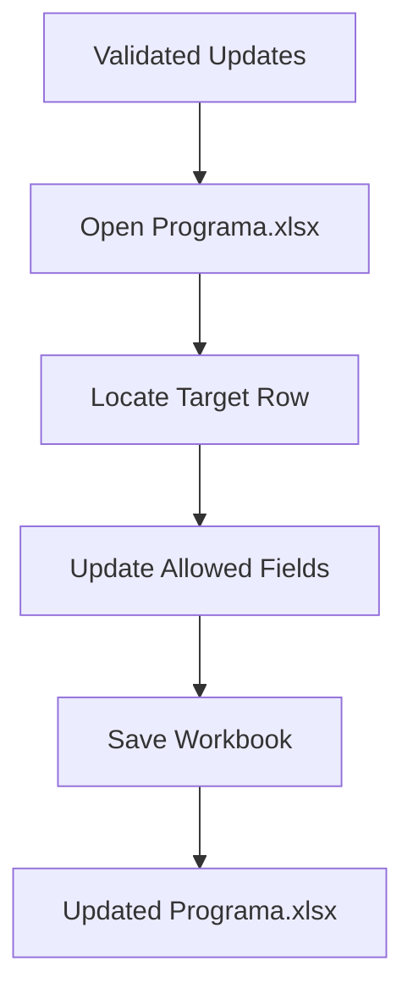

# Excel Loader Design

## Overview

The Excel Loader is responsible for updating the operational workbook `Programa.xlsx` using only validated data.

This component preserves the existing workbook structure and modifies only the fields defined by the business rules.

The loader never creates new operational rows or changes the workbook layout.

---

## Input

The Excel Loader receives:

| Source | Description |
|---|---|
| Validated Updates | Records approved by the Validation Layer. |
| Programa.xlsx | Master operational workbook. |

---

## Loading Workflow

---

## Loading Rules

### Commercial Services

For each validated commercial service:

Match using:

- Service

Update:

- Registration

No other columns are modified.

---

### Ticket Sales

For each validated ticket record:

Locate the corresponding operational row using:

- Service
- RouteSegment

Update:

- TicketsSold

No additional operational information is modified.

---

### Reserve Section

Reserve records are written into the Reserve section of the workbook.

Update:

- WorkshopStation
- Registration
- Status

---

## Protected Data

The loader must preserve all information not explicitly updated.

Examples include:

- Route definitions.
- Commercial circulation identifiers.
- Operational planning.
- Existing workbook formatting.
- Formulas.
- Cell styles.
- Merged cells.

---

## Error Handling

If a validated record cannot be located in `Programa.xlsx`:

- Skip the update.
- Register the issue in the execution log.

The workbook must remain consistent even if individual records cannot be updated.

---

## Output

The loading process produces:

| Output | Description |
|---|---|
| Updated `Programa.xlsx` | Operational workbook with synchronized information. |
| Execution Log | Summary of successful and skipped updates. |

---

## Out of Scope

The Excel Loader does not:

- Extract source documents.
- Validate business rules.
- Compare datasets.
- Correct inconsistent data.
- Modify workbook structure.